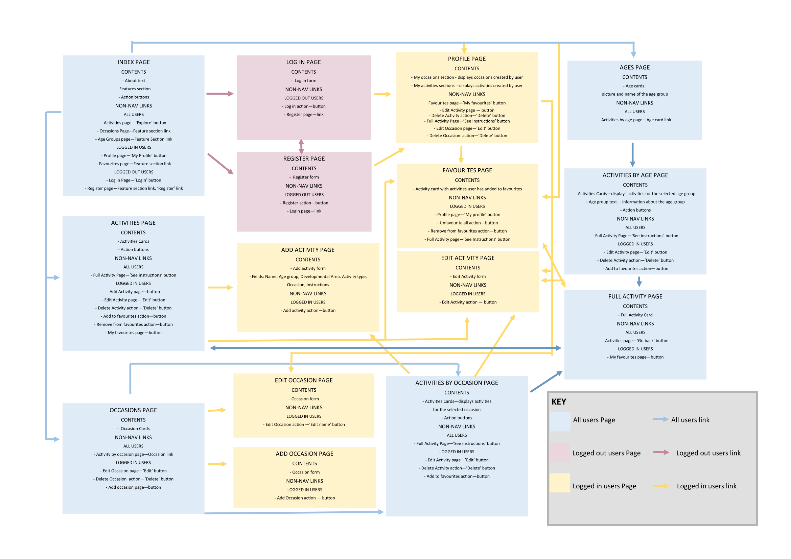
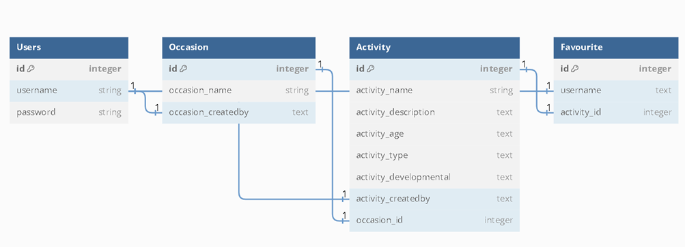

# LUDIDO Activity database

(Developer: Martyna Nowak)

[Live Webpage](https://ludido-ba4a496efb9b.herokuapp.com/)

## Table of Contents

1. [Project Goals](#project-goals)
    1. [Overview](#overview)
    2. [Goals](#goals)
2. [User Experience Design](#user-experience-design)
    1. [Strategy Plane](#strategy-plane)
    1. [Scope Plane](#scope-plane)
    2. [Structure Plane](#structure-plane)
    3. [Surface Plane](#surface-plane)
        1. [Wireframes](#wireframes)
        2. [Typography](#typography)
        3. [Imagery](#imagery)
        4. [Colour scheme](#colour-scheme)
3. [Features](#features)
    1. [Existing Features](#existing-features)
    2. [Future Features](#future-features)
4. [Technologies Used](#technologies-used)
    1. [Languages](#languages)
    2. [Frameworks and Tools](#frameworks-and-tools)
5. [Testing and bugs](#testing-and-bugs)
6. [Credits](#credits)
    1. [Media](#media)
    2. [Code used](#code-used)
    3. [Content](#content)
7. [Deployment](#deployment)
8. [Acknowledgements](#acknowledgements)

## Project Goals

### Overview

The main purpose of this project is to create a user-friendly website designed to find and share games and activities filtered by occasion, age group, developmental area and activity type. The website allows all users to browse existing activities and registered users to add or edit their own activities and occasions, as well as add existing activities to favourites. 

### Goals

1. A website that can be navigated easily and intuitively.
2. A clean design that catches the eye.
3. A website that looks good and responds correctly on all device sizes.
4. A website that is accessible to all users.
5. A website that allows users to register.
6. A website that allows registered users to add new entries to the database.
7. A website that allows registered users to edit their own entries.
8. A website that allows users to add existing activities to favourites.

## User Experience Design

### Strategy Plane

#### Target Audience

Target audience of this website are people working with children, i.e. playworkers, nannies, childminders, au-pairs, nursery nurses, teachers etc, as well as parents.

#### User Requirements and Expectations

* Links and buttons that work as expected.
* A simple and intuitive navigation system.
* Interactive feedback and notifications.
* Information presented in a clear and concise manner.
* Visually appealing design.
* Easy way to create an account.
* Easy way to log in for existing users.
* Ability to add, edit or delete own data.
* Ability to add existing activities to favourites.
* Accessibility.

#### User Stories

**As a User:**
1.	I want to know the purpose of the site immediately.
2.  I want to be able to navigate the site easily and intuitively.
3.	I want to be able to view the website on any device.
4.  I want to be able to return to the page without using browser buttons if I encounter an error.
5.  I want to view activities and occasions.
6.  I want to filter activities by occasion or by age.

**As a logged out User:**

7.  I want to be able to easily register a new account.
8.  I want to be able to locate a log in page easily.
9.  I want to know the benefits of registering as a user.

**As a logged in User:**

10.  I want to be able to see my profile.
11.	 I want to be able to add, edit or delete my own occasions.
12.	 I want to be able to add, edit or delete my own activities.
13.	 I want to easily locate occasions and activities I have created.
14.	 I want to be able to add existing activities to favourites.
15.  I want to be able to easily view my favourite activities.
16.  I want to be able to remove one or all of my favourite activities.
17.  I want to receive feedback when completed an action.

### Scope Plane

**Features Planned**

* All Users
1.  Responsive design
2.  Postgres database to store activities, occasions, users and user favourites
3.  Activities Page
4.  Occasions Page
5.  Age groups Page
6.  Pages displaying activities filtered by either occasion or age group
* Logged out Users
7.  Register Form
8.  Login Form
* Logged in Users
8.  Activities Page with Add Activity link and edit/delete links for own Activities
9.  Add Activity form
10. Edit Activity form and Delete Activity functionallity for Activities created by the user
11. Occasions Page with Add Occasion link and edit/delete links for own Occasions
12. Add Occasion form
13. Edit Occasion form and Delete Occasion functionallity for Occasions created by the user
14. Profile displaying Activities and Occasions created by the user
15. Favourites Page with functionallity to delete favourites

### Structure Plane

Based on the the user stories and planned features, I created a website flowchart:

The website structure targets the user stories as follows:

User Story 2:  I want to be able to navigate the site easily and intuitively.

* Navigation bar to be displayed on all pages with relevant nav links, based on whether the user is logged in or not
* The user is led through site in an intuitive way
    * Register page contains a link to Log in Page and vice versa
    * Logging in leads to the user profile
    * Full Activity page contains links to return to Activities Page or Favourites if the user is logged in
    * Occasion and Ages pages lead to filtered Activities page

User Story 3:	I want to be able to view the website on any device.

* The website is built with Bootstrap CSS and fully tested to ensure it is responsive on differend size devices

User Story 4:  I want to be able to return to the page without using browser buttons if I encounter an error.

* Custom Error 404 and Error 500 built
* A link to return to the index page

User Story 5:  I want to view activities and occasions.

* Activities page contains Activities cards with clickable links to see more information
* Occasions page contains Occasion cards

User Story 6:  I want to filter activities by occasion or by age.

* Occasion page contains clickable links leading users to a page which displays filtered Activities
* Ages page contains clickable links leading users to a page which displays filtered Activities

User Story 7:  I want to be able to easily register a new account.

* The navbar contains a link to Register Page
* Index Page and Log in Page contain links to Register Page
* Register form is easy to fill in

User Story 8:  I want to be able to locate a log in page easily.

* The navbar contains a link to Log In Page
* Index Page and Register Page contain links to Log in Page
* User is redirected to Log in Page if they try to access a page avaliable to logged in users only

User Story 9:  I want to know the benefits of registering as a user.

* Index Page contains information on features avaliable to logged in users

User Story 10:  I want to be able to see my profile.
* The nav bar contains a link to User profile for logged in users
* Logging in directs users to Profile page

User Story 11:	 I want to be able to add, edit or delete my own occasions.

* Occasions Page contains a link to Add Occasion Page
* Add Occasion page contains a form allowing the user to add their own occasions easily
* Upon submission the created Occasion will appear on Occasions Page and User Profile Page
* Occasion cards displayed on Occasion Page and in User Profile feature a link to Edit Occasion Page
* Edit Occasion page contains a form
* Upon submission the user is notified they have successfully edited the Occasion
* Occasion cards displayed on Occasion Page and in User Profile feature a button to Delete Occasion function
* When the delete button is clicked, a modal appears to ensure the user intends to delete the occasion
* The user is notified they have successfully deleted the Occasion

User Story 12:	 I want to be able to add, edit or delete my own activities.

* Activities Page contains a link to Add Activity Page
* Add Activity page contains a form allowing the user to add their own activities easily
* Upon submission the created Activity will appear on Activity Page, User Profile Page and on the relevant Occasion and Age Group pages
* Activity cards displayed on Activity Page, Activity by Occasion Page, Activities by Age Page and in User Profile feature a button to Edit Activity Page
* Edit Activity page contains a form
* Upon submission the user is notified they have successfully edited the Activity
* Activity cards displayed on Activity Page, Activity by Occasion Page, Activities by Age Page and in the User Profile feature a button to trigger the Delete Activity function
* When the delete button is clicked, a modal appears to ensure the user intends to delete the Activity
* The user is notified they have successfully deleted the Activity

User Story 13:	 I want to easily locate occasions and activities I have created.

* Profile page contains sections featuring occasions and activities created by the user

User Story 14:	 I want to be able to add existing activities to favourites.

* Activity cards on Activities Page, Activities by Occasion Page and Activities by Age Page contain a button triggering the Add to Favourites Function 

User Story 15:  I want to be able to easily view my favourite activities.

* Index Page, Activities Page and Profile Page contain links to Favourites Page

16.  I want to be able to delete one or all of my favourite activities.

* Activity cards on Activities Page, Activities by Occasion Page and Activities by Age Page contain a button triggering the Remove from Favourites Function if the Activity is favourited
* Favourites Page features a button triggering the Unfavourite All function

17.  I want to receive feedback when completed an action.

* Flash messages appear to confirm an action initiated by user was executed.

#### Database Schema

#### CRUD

CRUD has been implemented as following:

1. Create

* Logged in users can create their own activities.
* Logged in users can create their own occasions.

2. Read

* Activities and occasions added by users can be easily viewed.
* Users can filter existing activities by occasions.
* Users can filter existing activities by age groups.
* Logged in users can see activities and occasions they have created on their profile.

2. Update

* Logged in users can easily edit their own occasions.
* Logged in users can easily edit their own activities.
* Edit activity functionallity can be accessed from the Activities page, Activities by Occasions page, Activities by Age page and Profile Page.

3. Delete

* Logged in users can delete their own occasions.
* Logged in users can delete their own activities.
* Delete activity functionallity can be accessed from the Activities page, Activities by Occasions page, Activities by Age page and Profile Page.
* After initially pressing the Delete button, a modal pops up asking the user if they truly intend to delete their activity or occasions.

Executing Create, Update and Delete functionallity results in an immediate feedback to the user via flash messages.

### Surface Plane

#### Wireframes

Index Page

Login Page

Register Page

Profile Page

Activities Page

Full Activity Page

Add Activity Page

Occasions Page

Add/Edit Occasion Page

Ages Page

Activities by Age Page

Custom Error 404 and 500 Pages

#### Typography

The font used for the logo and page titles, Kablammo, was selected as it looks playful and I decided it was fitting for the page. It was complemented nicely by the font chosen for the Navbar links, Chewy. Finally, the font used for all the other text, Varela Round, was selected as it is easy to read and dyslexia-friendly.

#### Imagery

The images used on the Ages and Activities by Age pages are taken from Pexels and represent children at each developmental stage.

All the other images used throughout the page are generated by Canva and the colours match the website's colout palette.

#### Colour scheme

The colour orange was chosen as according to the colour theory, it is associated with playfulness, exitement and energy. The other colours were then selected to complement it. The colours were picked with accessibility in mind, using the WebAIM Contrast checker.

## Features

### Existing Features

### All Pages

**Navigation Bar**

* Fully responsive; collapapses into a toggler menu on small devices;
* Features a logo which leads to the Index page when clicked;
* Logo increases in size on hover;
* Features links to the Index, Activities, Occasion and Ages pages;
* For users that are not logged in, it features links to the Register and Log In pages;
* For logged in users, it features links to the Profile Page and Log Out functionallity;
* Links change colour on hover.

User Stories covered: 2, 3.

**Footer**

* Contains credits and a link to the developer's Github and Linkedin accounts;
* The link icons change colour on hover;

**Flash messages**

* Flash messages give user feedback after they completed an action, e.g. delete an Occasion or add an Activity to favourites;
* They also appear to inform a user they do not have an access to certain pages; e.g. if a user who is not logged in tries to add an Activity;
* A flash message appears upon logging in to inform the user they need to reload their profile to see their Occasions and Activities;
* Flash messages div is incorporated into the header and matches the aesthetic of the website.

User Stories covered: 17.

### Index Page

**Text paragraph**

* Informs the user about the purpose of the site;
* Lists benefits of creating an account.
* Contains a link to the document where the site's name came from.

User Stories covered: 1, 9.

**Action Buttons**

* The Explore button leads to the Activities page;
* Logged in users see the My Profile button which leads to the Profile Page;
* Logged out users see a Log in button and a Register link;
* The buttons change colour on hover.

User stories covered: 2, 8, 13. 

---

**Features section**

* Three containers of images and text which describe some of the website's features;
* The containers are clickable links and increase in size on hover;
* The first container informs the user they can add their own occasion or filter activities by existing occasions.
* It leads to the Occasions page when clicked.
* The second container informs the user they can filter activities by age and learn more about play at each development stage.
* It leads to the Ages page when clicked.
* The third container informs the user they can add activities to favourites if they have an account.
* It leads to the Favourites page if the user is logged in and the Register page if they are not logged in.
* The images used match the imagery used in the header as well as the colour scheme.

User stories covered: 1, 7, 15.

### Activities Page

**Add Activity button**

* Displayed if the user is logged in;
* Leads to the Add Activity page;
* Changes colour on hover.

User stories covered: 2, 12.

**My Favourites button**

* Displayed if the user is logged in;
* Leads to the Favourites page;
* Changes colour on hover.

User stories covered: 2, 12, 15.

**Activity cards**

* Display activities added by users;
* Contain activity name, age group, developmental area, activity type, occasion and the username of the user who created the activity.
* Contain See Instructions button;
* If the user is logged in and has created the activity, the cards contain Edit and Delete buttons;
* If the user is logged in and has not created the activity, the cards contain Add to Favoutites/Remove from favourites button.

User stories covered: 5.

**See Instructions button**

* Leads to the Full Activity page where the users can obtain instructions for the selected activity;
* Changes colour on hover.

User stories covered: 5.

**Edit and Delete button**

* Displayed if the user is logged in and has created the activity;
* The Edit button leads to the Edit Activity page;
* The Delete button triggers a modal which ask the user if they are sure they want to delete the activity.
* The Delete button on the modal triggers the delete_activity functionallity.

User stories covered: 12.

**Add to favourites button**

* Displayed if the user is logged in and is not the author of the activity.
* Adds the activity to the user's favourites when clicked.

User stories covered: 14.

**Remove from favourites button**

* Displayed if the user is logged in, is not the author of the activity and has previously added the activity to their favourites.
* Removes the activity from the user's favourites when clicked.

User stories covered: 16.

### Add Activity Page

**Add Activity form**

* Contains the following fields: Activity Name, Age Group, Developmental Area, Activity Type, Occasion and Instructions.
* The Activity Name and Instruction fields allow the user to type in their own input.
* All the other fields have dropdown options to select.
* All the fields are required.
* The activity name must be unique; if the chosen activity name already exists, the user is notified via a flash message.

User stories covered: 12. 

**'Add Activity' button**

* Adds the new activity to the Database when clicked.
* Changes colour on hover.
* Upon adding an activity, the action is confirmed to user via flash message.

User stories covered: 12.

### Edit Activity page

**Edit Activity form**

* Contain all the same fields and logic as the Add Activity form.
* The fields are populated with the existing data for the selected activity.

User stories covered: 12.

**'Edit Activity' button**

* Amends the activity details in the Database.
* After editing the activity, the action is confirmed to the user via flash message.

User stories covered: 12.

### Occasions Page

**'Add Occasion' button**

* Displayed if the user is logged in;
* Leads to the Add Occasion Page when clicked;
* Changes colour on hover.

User stories covered: 2, 11.

**Occasion cards**

* Display occasions added by users.
* Contain 'Edit' and 'Delete' button if the user is logged in and is an author of the occasion.
* The name of the activity is clickable and leads to a relevant Activities by Occasion page.

User stories covered: 5, 6.

**'Edit' and 'Delete' buttons**

* Displayed if the user is logged in and has created the occasion.
* The 'Edit' button leads to the Edit Occasion page.
* The 'Delete' button opens a modal which asks the user if they definitely intend to delete the occasion.
* The modal informs the user that upon deleting an occasion, all associated activities will be deleted as well.
* The 'Delete' button on the modal triggers the delete_occasion functionallity.

User stories covered: 11.

### Add Occasion Page

**Add Occasion form**

* Contains an Occasion Name field.
* The occasion name must be unique; if the chosen name already exists, the user is notified via flash message.
* The field is required.

User stories covered: 11.

**'Add Occasion' button**

* Adds a new occasion to the Database when clicked.
* Changes colour on hover.
* After adding the new occasion, the user's action is confirmed via flash message.

User stories covered: 11.

### Edit Occasion Page

**Edit Occasion form**

* Contains an Occasion Name field.

User stories covered: 11.

**'Edit Occasion' button**

* Edits the occasion name in the Database when clicked.
* Changes colour on hover.
* After editing the occasion, the user's action is confirmed via flash message.

User stories covered: 11.

### Activity by Occasion Page

**Activity by Occasion cards**

* Display Activities within relevant Occasion.
* Contain 'See Instructions' button.
* If the user is logged in, contain either 'Edit' and 'Delete' buttons or 'Add to/Remove from Favourites' buttons.

User stories covered: 6, 12, 14, 16.

### Ages Page

**Age group cards**

* Contain the eight age groups listed in the Add Activity form.
* Each card contains a relevant image and a name of the age group.
* The age groups are taken from the /data/ages.json file.
* The cards are clickable and lead to a relevant Activities by Age page when clicked.
* The cards increase in size on hover to indicate to user that they are clickable.

User stories covered: 6.

### Activities by Age Page

**Age group text div**

* Display a picture and a short paragraph about play at the selected development stage.
* The picture and text are taken from the /data/ages.json file.

**Activities by Age cards**

* Display Activities for the relevant age group.
* Contain the 'See Instructions' button.
* If the user is logged in, contain either 'Edit' and 'Delete' buttons or 'Add to/Remove from Favourites' buttons.

User stories covered: 6, 12, 14.

### Profile Page

**User's name**

* Display a capitalized username of the user.

**'My favourites' button**

* Leads to the Favourites page when clicked.
* Changes colour on hover.

User stories covered: 15.

**'My Occasions' dropdown**

* Displays the occasions created by the user when clicked.
* Changes colour on hover.

User stories covered: 13.

**'My Activities' dropdown**

* Displays the activities created by the user when clicked.
* Changes colour on hover.

User stories covered: 13.

**My Occasions' cards**

* Display the Occasions created by the user.
* Contain 'Edit' and 'Delete' buttons.

User stories covered: 11, 13.

**'My Activities' cards**

* Display the activities created by the user.
* Contain 'See Instructions' button.
* Contain 'Edit' and 'Delete' button.
* Unlike the activies cards displayed on other pages, the one on the Profile page do not contain a 'Created by:' field since they have been created by the user viewing the profile.

User stories covered: 12, 13.

### Favourites page

**My Profile button**

* Leads to the Profile page when clicked.
* Changes colour on hover.

User Stories covered: 2.

**Unfavourite All button**

* Removes all the user's favourites.
* Changes colour on hover.

User Stories covered: 16.

**Favourite Activity cards** 

* Display activities favourited by the user.
* Contain a 'See Instructions' button.
* Contain a 'Remove from favourites button.

User Stories covered: 15, 16.

### Register page

**Register form**

* Contains three fields: Username, Password and Confirm password. All fields are required.
* The user can only registered if the passwords match.
* The passwords are hashed for security.
* The username needs to be unique; if the username is already taken, the user is notified via flash message.

User stories covered: 7.

**'Register' button**

* Adds a new user to the user table.

User stories covered: 7.

**'Log in' link**

* Redirects the user to the Log in page if they already have an account.

User stories covered: 2, 8.

### Log in page

**Log in form**

* Contains two fields: 'Username' and 'Password'.
* The password is hashed for security.

User stories covered: 8

**'Log in' button**

* When clicked:
    * If the username does not match an existing account, the user is notified via a flash message.
    * If the password does not match the username, the user is notified via a flash message.
    * If the username and password do match, the user is logged in and redirected to the Profile Page.

**'Register Here' link**

* Redirects the user to the Register page if they do not have an account yet.

User stories covered: 2, 7.

### Custom Error Pages

**Page images and text**

* Appear when the user encounters an error.
* Colours and aesthetic match the rest of the page.

**Error page button**

* Redirects the user back to the Index page.
* Changes colour on hover.

User stories covered: 4.

### Future Features

In the future development, I would like to add the following features:

* An option to filter the activities by Activity Type and Developmental Area.
* An option to add more than one age group and occasion to an activity.
* A search feature.
* An option to add a source link and images to an activity.
* An edit/delete user account functionality.
* A reset password functionality.
* A feedback form.
* Improved formatting of the Instruction section on the Full Activity page.
* Return back to the Activities by Age or Activities by Occasion after clicking edit, delete, Add to or Remove from Favourites buttons on these pages.

## Technologies Used

### Languages

* HTML
* CSS
* Python

### Frameworks and Tools

* Heroku
* Flask
* Jinja
* Bootstrap CSS
* Google Fonts
* Gitpod
* Github
* Werkzeug
* SQLAlchemy
* ElephantSQL
* Balsamiq
* dbdiagram
* Canva
* Gyazo Video 

## Testing and bugs

For more information on testing, [see here](https://github.com/mmnowak/mp3_ludido/blob/main/TESTING.md).

## Credits

### Media

**Images used for the age groups**

* [By Tatiana Syrikova](https://www.pexels.com/photo/baby-in-white-onesie-holding-wooden-blocks-3933250/)
* [By cottonbro studio](https://www.pexels.com/photo/boy-in-white-long-sleeve-shirt-and-green-pants-sitting-on-floor-beside-girl-in-red-3661452/)
* [By cottonbro studio](https://www.pexels.com/photo/a-child-sitting-on-the-floor-playing-with-toys-3661335/)
* [By pixabay](https://www.pexels.com/photo/boy-in-white-tank-top-playing-blue-coupe-die-cast-near-brown-wooden-bench-chair-during-daytime-163768/)
* [By Dominika Roseclay](https://www.pexels.com/photo/low-angle-photo-of-a-boy-playing-soccer-2682543/)
* [By Ron Lach](https://www.pexels.com/photo/kids-playing-in-the-backyard-10044378/)
* [By Yaroslav Shuraev](https://www.pexels.com/photo/two-people-playing-chess-7697984/)
* [By Ivan Samkov](https://www.pexels.com/photo/baby-boy-playing-with-wooden-toy-on-floor-8504336/)

**Favicon** 

The favicon was created using [Favicon.io](https://favicon.io/).

**Other images**

All the other images were created in Canva using elements by [Sketchify](https://www.canva.com/p/sketchify/) and adjusting the colours to match the website.

### Code Used

Navbar, Modals, Cards, Buttons and Footer were created with Bootstrap CSS.

Error handling was done following a tutorial by [Geeksforgeeks](https://www.geeksforgeeks.org/python-404-error-handling-in-flask/)

All the other code was written following tutorials by Code Institute, 

### Content

The descriptions of play behaviours at each developmental stage were taken from a textbook "The Essence of Play" by J. Howard and K. McInnes.

The instructions for example activities featured on the page are from Pinterest or [Early Childhood Activities bank](https://www.educationworld.com/a_earlychildhood/archives/activity.shtml).

## Deployment

### Forking the Github Repository
1. Open the Github repository at https://github.com/mmnowak/mp3_ludido/
2. Click on the fork button found in the top right corner.

### Creating a Local Clone
1. Open the Github repository at https://github.com/mmnowak/mp3_ludido/
2. Click on the Code button;
3. Choose to clone using either HTTPS, SSH, or Github CLI and click the copy button to copy the link address;
4. In a code editor, change the current working directory to the location desired for the cloned directory;
5. Type 'git clone' into the terminal and paste the link address copied earlier;
6. Press enter to create a local clone.

### Creating a Database with ElephantSQL
1. Log in with GitHub to the ElephantSQL.
2. Create new team.
3. Click 'Create New Instance'.
4. Choose your plan.
5. Select your region.
6. Click 'Review'.
7. Click 'Create instance'.
8. Click on the name of your database and copy the URL to your clickboard.

### Creating a Heroku app
1. Type `pip3 freeze --local > requirements.txt` into the Gitpod terminal to create a requirements.txt file.
2. Type `echo web: python app.py > Procfile` into the terminal to create a Procfile.
3. Commit and push the changes to Github.
4. Login to your Heroku Account.
5. Click 'New' -> 'Create new app'.
6. Enter a name for your project and select your region.
7. Click 'Create app'.
8. Go to 'Settings', click 'Reveal Config Vars'.
9. Add the following variables:
    * DATABASE_URL: your ElephantSQL database url
    * IP: 0.0.0.0
    * PORT: 5000
    * SECRET_KEY: your secret key
    * DEBUG: True
10. Click on the 'Deploy' tab.
11. Click 'Connect to Github'.
12. Find your depo and click 'Connect'
13. Click 'Deploy Branch'.
14. Click 'More' -> 'Run console'
15. Type in `python3`
16. Type `from ludido import db` -> `db.create_all()` -> `exit().`
17. Click 'Open App'.

## Acknowledgements

I would like to express my gratitude to:

* My mentor, Mo Shami, for his guidance, support and advice;
* My friends and family for kindly testing the website on their devices.