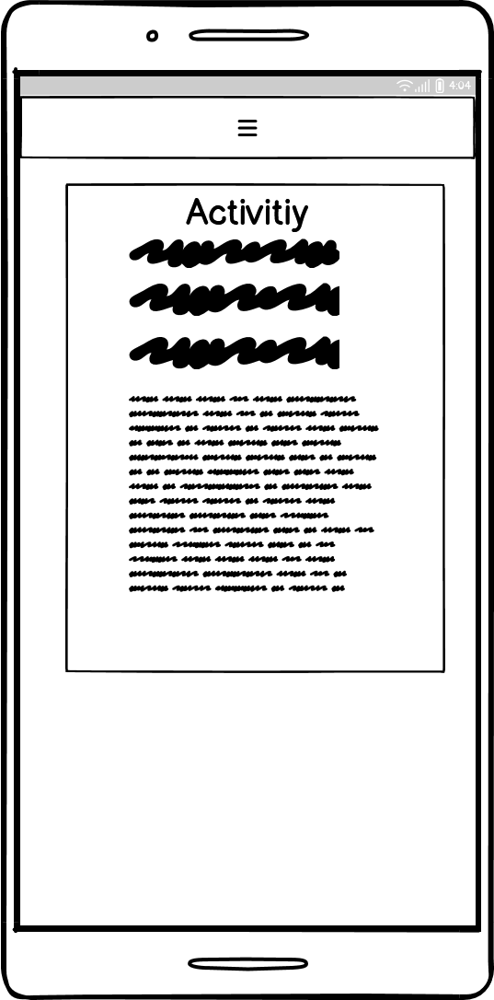

# LUDIDO

(Developer: Martyna Nowak)

[Live Webpage](https://mmnowak.github.io/tarot-quiz/index.html)

## Table of Contents

1. [Project Goals](#project-goals)
    1. [Overview](#overview)
    2. [Goals](#goals)
2. [User Experience](#user-experience)
    1. [Target Audience](#target-audience)
    1. [User Requirements and Expectations](#user-requirements-and-expectations)
    2. [User Stories](#user-stories)
3. [Design](#design)
    1. [Colour scheme](#colour-scheme)
    2. [Typography](#typography)
    3. [Imagery](#imagery)
    4. [Wireframes](#wireframes)
4. [Features](#features)
5. [Technologies Used](#technologies-used)
    1. [Languages](#languages)
    2. [Frameworks and Tools](#frameworks-and-tools)
6. [Testing and bugs](#testing-and-bugs)
7. [Credits](#credits)
    1. [Media](#media)
    2. [Code used](#code-used)
    3. [Content](#content)
8. [Deployment](#deployment)
10. [Acknowledgements](#acknowledgements)

## Project Goals

### Overview

The main purpose of this project is to create a user-friendly website designed to find and share games and activities filtered by occasion, age group, developmental area and activity type. The website allows all users to browse existing activities and registered users to add or edit their own activities and occasions, as well as add existing activities to favourites. 

### Goals

1. A website that can be navigated easily and intuitively.
2. A clean design that catches the eye.
3. A website that looks good and responds correctly on all device sizes.
4. A website that is accessible to all users.
5. A website that allows users to register.
6. A website that allows registered users to add new entries to the database.
7. A website that allows registered users to edit their own entries.
8. A website that allows users to add existing activities to favourites.

## User Experience

### Target Audience

Target audience of this website are people working with children, i.e. playworkers, nannies, childminders, au-pairs, nursery nurses, teachers etc, as well as parents.

### User Requirements and Expectations

* Links and buttons that work as expected.
* A simple and intuitive navigation system.
* Interactive feedback and notifications.
* Information presented in a clear and concise manner.
* Visually appealing design.
* Easy way to create an account.
* Easy way to log in for existing users.
* Ability to add, edit or delete own data.
* Ability to add existing activities to favourites.
* Accessibility.

### User Stories

#### First Time visitor
1.	As a first-time user, I want to know the purpose of the site immediately.
2.	As a first-time user, I want to be able to browse activities by categories.
3.	As a first-time user, I want to be able to create a new account.

#### Returning visitor
8.	As a returning user, I want to be able to add, edit or delete my own occasions.
9.	As a returning user, I want to be able to add, edit or delete my own activities.
10.	As a returning user, I want to easily locate occasions and activities I have created.
11.	As a returning user, I want to be able to add existing activities to favourites.
12. As a returning user, I want to be able to easily view my favourite activities.
13. As a returning user, I want to be able to delete one or all of my favourite activities.
## Design

### Wireframes

---

---

---

---

---

---

---

---

---

---

---

---

---

---

---

---

---

---

