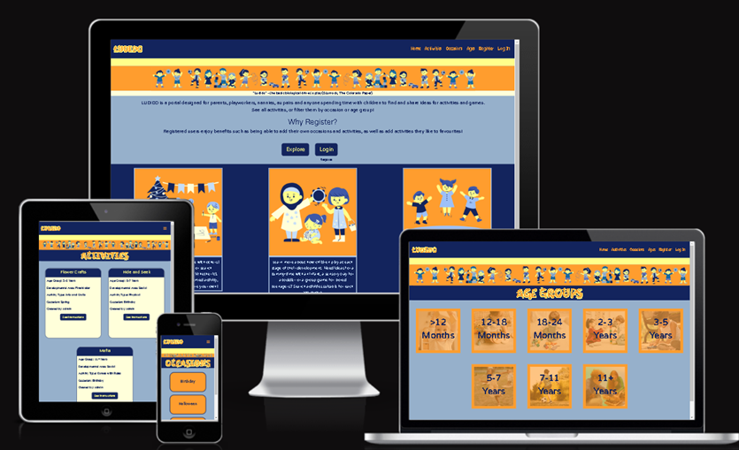
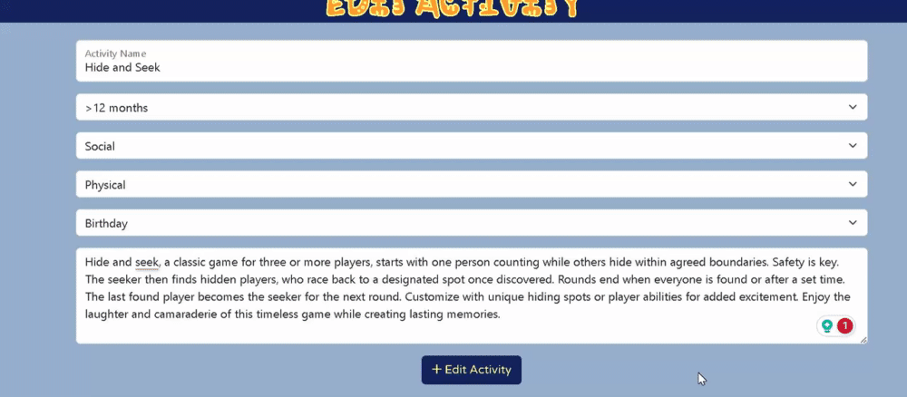

# LUDIDO Activity database

(Developer: Martyna Nowak)

[Live Webpage](https://ludido-ba4a496efb9b.herokuapp.com/)

This is the testing documentation for the LUDIDO website. For the README file, [click here](https://github.com/mmnowak/mp3_ludido/blob/main/README.md)

## Table of Contents

1. [Introduction](#introduction)
2. [Automated Testing](#automatic-testing)
    1. [HTML Validation](#html-validation)

## Introduction

## Automated Testing

### HTML Validation

The W3C Markup Validation Service was used to validate the HTML of the website. All errors found were corrected, currently there is no errors.

See results:

* [Index page](https://validator.w3.org/nu/?doc=https%3A%2F%2Fludido-ba4a496efb9b.herokuapp.com%2Findex)
* [Activities page](https://validator.w3.org/nu/?doc=https%3A%2F%2Fludido-ba4a496efb9b.herokuapp.com%2Factivities)
* [Add Activity page](https://validator.w3.org/nu/?doc=https%3A%2F%2Fludido-ba4a496efb9b.herokuapp.com%2Fadd_activity)
* [Edit Activity page](https://validator.w3.org/nu/?doc=https%3A%2F%2Fludido-ba4a496efb9b.herokuapp.com%2Fedit_activity%2F5)
* [Occasions page](https://validator.w3.org/nu/?doc=https%3A%2F%2Fludido-ba4a496efb9b.herokuapp.com%2Foccasions)
* [Add Occasion page](https://validator.w3.org/nu/?doc=https%3A%2F%2Fludido-ba4a496efb9b.herokuapp.com%2Fadd_occassion)
* [Edit Occasion page](https://validator.w3.org/nu/?doc=https%3A%2F%2Fludido-ba4a496efb9b.herokuapp.com%2Fadd_occassion)
* [Ages page](https://validator.w3.org/nu/?doc=https%3A%2F%2Fludido-ba4a496efb9b.herokuapp.com%2Fage-groups)
* [Activities by Age page](https://validator.w3.org/nu/?doc=https%3A%2F%2Fludido-ba4a496efb9b.herokuapp.com%2Factivities_by_age%2F5)
* [Register page](https://validator.w3.org/nu/?doc=https%3A%2F%2Fludido-ba4a496efb9b.herokuapp.com%2Fregister)
* [Log in page](https://validator.w3.org/nu/?doc=https%3A%2F%2Fludido-ba4a496efb9b.herokuapp.com%2Flogin)
* [Profile page](https://validator.w3.org/nu/?doc=https%3A%2F%2Fludido-ba4a496efb9b.herokuapp.com%2Fprofile%2Fadmin)
* [Favourites page](https://validator.w3.org/nu/?doc=https%3A%2F%2Fludido-ba4a496efb9b.herokuapp.com%2Ffavourite-activities%2Fadmin)

### CSS validation

The W3C Jigsaw CSS Validation Service was used to validate the css file for the website via file upload. No errors were found.

## Manual Testing

### Testing User Stories

1.	I want to know the purpose of the site immediately.

| **Feature** | **Action** | **Expected Result** | **Actual Result** | **Works as expected** |
|:-----------:|:----------:|:-------------------:|:-----------------:|:---------------------:|
| Index Page | Navigate to the index page | The index text paragraph displays |  | Yes |

2.  I want to be able to navigate the site easily and intuitively.

| **Feature** | **Action** | **Expected Result** | **Actual Result** | **Works as expected** |
|:-----------:|:----------:|:-------------------:|:-----------------:|:---------------------:|
| Navigation bar | Click on the nav links | Correct pages load |  | Yes |
| Log in page | Log in | Logging in leads to user profile |  | Yes |
| Register page | Navigate to the Register page and click the log in link | Log in page opens |  | Yes |
| Log in page | Navigate to the Log in page and click the Register link | Register page opens |  | Yes |
| Full Activity page | Click on either the'Return to Activities' button or the 'Favourites' button | Correct page opens |  | Yes |
| Occasions page | Click on a occasion name | A new page opens with activities filtered by the occasion |  | Yes |
| Ages page | Click on an age group | A new page opens with activities filtered by the age group |  | Yes |

3.	I want to be able to view the website on any device.

| **Feature** | **Action** | **Expected Result** | **Actual Result** | **Works as expected** |
|:-----------:|:----------:|:-------------------:|:-----------------:|:---------------------:|
| The webpage | Open the website on your device | The website displays correctly | [See here](#device-testing) | Yes |

4.  I want to be able to return to the page without using browser buttons if I encounter an error.

| **Feature** | **Action** | **Expected Result** | **Actual Result** | **Works as expected** |
|:-----------:|:----------:|:-------------------:|:-----------------:|:---------------------:|
| Error 404 Page | Click on the 'Go Back' button | The Index page opens |  | Yes |
| Error 500 Page | Click on the 'Go Back' button | The Index page opens | Works as expected | Yes |

5.  I want to view activities and occasions.

| **Feature** | **Action** | **Expected Result** | **Actual Result** | **Works as expected** |
|:-----------:|:----------:|:-------------------:|:-----------------:|:---------------------:|
| Activities Page | Navigate to the Activites Page | Activity cards are displayed |  | Yes |
| Activity cards | Click on the 'See Instructions' button | Full Activity page opens |  | Yes |
| Occasions Page | Navigate to the Occasions Page | Occasion cards are displayed |  | Yes |

6.  I want to filter activities by occasion or by age.

| **Feature** | **Action** | **Expected Result** | **Actual Result** | **Works as expected** |
|:-----------:|:----------:|:-------------------:|:-----------------:|:---------------------:|
| Occasion cards | Click on a occasion name | Activities by Occasion page opens, displays activities for the correct occasion |  | Yes |
| Age Group cards | Click on an age group card | Activities by Age page opens, displays activities for the correct age |  | Yes |

7.  I want to be able to easily register a new account.

| **Feature** | **Action** | **Expected Result** | **Actual Result** | **Works as expected** |
|:-----------:|:----------:|:-------------------:|:-----------------:|:---------------------:|
| Register form | Fill out the register form | A new account is created |  | Yes |

8.  I want to be able to locate a log in page easily.

| **Feature** | **Action** | **Expected Result** | **Actual Result** | **Works as expected** |
|:-----------:|:----------:|:-------------------:|:-----------------:|:---------------------:|
| Navigation bar | Click on the 'Log in' link | The Log in page opens |  | Yes |
| Index page | Click on the 'Log in' link | The Log in page opens |  | Yes |
| Register page | Click on the 'Log in' link | The Log in page opens |  | Yes |
| A page accesible to logged in users only | Try to access the page without logging in | Redirected to the Log in page |  | Yes |

9.  I want to know the benefits of registering as a user.

| **Feature** | **Action** | **Expected Result** | **Actual Result** | **Works as expected** |
|:-----------:|:----------:|:-------------------:|:-----------------:|:---------------------:|
| Index Page | Navigate to the Index Page | A paragraph with information on features avaliable to logged in users appears |  | Yes |

10.  I want to be able to see my profile.

| **Feature** | **Action** | **Expected Result** | **Actual Result** | **Works as expected** |
|:-----------:|:----------:|:-------------------:|:-----------------:|:---------------------:|
| Navigation bar | Click on the 'Profile' link | The Profile page loads |  | Yes |
| Log in page | Log in to your accout | The Profile page loads |  | Yes |

11.	 I want to be able to add, edit or delete my own occasions.

| **Feature** | **Action** | **Expected Result** | **Actual Result** | **Works as expected** |
|:-----------:|:----------:|:-------------------:|:-----------------:|:---------------------:|
| Occasions page | Click on the 'Add Occasion' button | The Add Occasion page opens |  | Yes |
| Add Occasions form | Fill out the form | A new occasion is added |  | Yes |
| Occasion cards | Click on the 'Edit' button | The Edit Occasion page opens |  | Yes |
| Edit Occasion form | Fill out the form | The occasion is edited |  | Yes |
| Occasion cards | Click on the 'Delete' button | The occasion is removed from the DB |  | Yes |

12.	 I want to be able to add, edit or delete my own activities.

| **Feature** | **Action** | **Expected Result** | **Actual Result** | **Works as expected** |
|:-----------:|:----------:|:-------------------:|:-----------------:|:---------------------:|
| Activities page | Click on the 'Add Activity' button | The Add Activity page opens |  | Yes |
| Add Activity form | Fill out the form | A new activity is added |  | Yes |
| Activity cards | Click on the 'Edit' button | The Edit Activity page opens |  | Yes |
| Edit Activity form | Fill out the form | The activity is edited |  | Yes |
| Activity cards | Click on the 'Delete' button | The activity is removed from the DB |  | Yes |

13.	 I want to easily locate occasions and activities I have created.

| **Feature** | **Action** | **Expected Result** | **Actual Result** | **Works as expected** |
|:-----------:|:----------:|:-------------------:|:-----------------:|:---------------------:|
| Profile page | Click on the 'My Occasions' dropdown | Occasions created by the user appear |  | Yes |
| Profile page | Click on the 'My Activities' dropdown | Activities created by the user appear |  | Yes |

14.	 I want to be able to add existing activities to favourites.

| **Feature** | **Action** | **Expected Result** | **Actual Result** | **Works as expected** |
|:-----------:|:----------:|:-------------------:|:-----------------:|:---------------------:|
| Activity cards | Click on the 'Add to favourites' button | The activity is added to favourites |  | Yes |

15.  I want to be able to easily view my favourite activities.

| **Feature** | **Action** | **Expected Result** | **Actual Result** | **Works as expected** |
|:-----------:|:----------:|:-------------------:|:-----------------:|:---------------------:|
| Index page | Click on the third feature section | My Favourites page opens |  | Yes |
| Activities page | Click on the 'My favourites' button | My Favourites page opens |  | Yes |
| Profile page | Click on the 'My favourites' button | My Favourites page opens |  | Yes |
| Full Activity page | Click on the 'My favourites' button | My Favourites page opens |  | Yes |

16.  I want to be able to remove one or all of my favourite activities.

| **Feature** | **Action** | **Expected Result** | **Actual Result** | **Works as expected** |
|:-----------:|:----------:|:-------------------:|:-----------------:|:---------------------:|
| Activity cards | Click on the 'Remove from Favourites' button | The activity is removed from favourites |  | Yes |
| Favourites page | Click on the 'Unfavourite All' button | All favourite activities are removed from favourites |  | Yes |

17.  I want to receive feedback when completed an action.

| **Feature** | **Action** | **Expected Result** | **Actual Result** | **Works as expected** |
|:-----------:|:----------:|:-------------------:|:-----------------:|:---------------------:|
| Add Activity page | Add a new activity | A flash message appears |  | Yes |
| Edit Activity page | Edit the activity | A flash message appears |  | Yes |
| Activities cards | Click on the 'delete' button | A flash message appears |  | Yes |
| Add Occasion page | Add a new occasion | A flash message appears |  | Yes |
| Edit Occasion page | Edit the occasion | A flash message appears |  | Yes |
| Occasion cards | Click on the 'delete' button | A flash message appears |  | Yes |
| Activities cards | Click on the 'Add to Favourites' button | A flash message appears |  | Yes |
| Activities cards | Click on the 'Remove from Favourites' button | A flash message appears |  | Yes |
| Favourites page | Click on the 'Unfavourite all' button | A flash message appears |  | Yes |
| Navigation bar | Click on the 'Log out' link | A flash message appears |  | Yes |
| Log in page | Log in | A flash message appears |  | Yes |
| A page accesible to logged in users only | Try to access the page without logging in | A flash message appears |  | Yes |