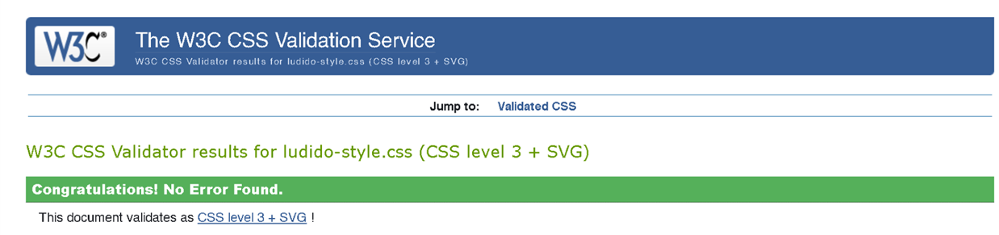
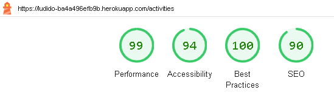
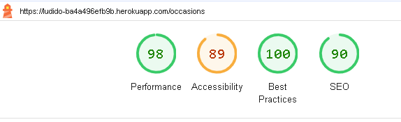
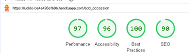
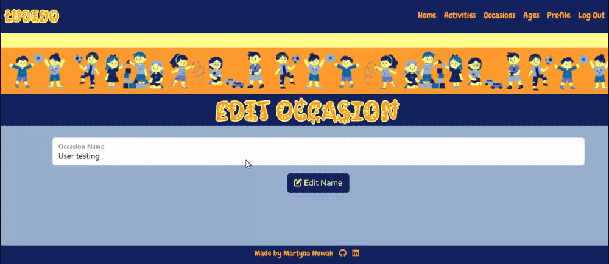
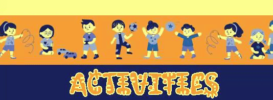

# LUDIDO Activity database

(Developer: Martyna Nowak)

[Live Webpage](https://ludido-ba4a496efb9b.herokuapp.com/)

This is the testing documentation for the LUDIDO website. For the README file, [click here](https://github.com/mmnowak/mp3_ludido/blob/main/README.md)

## Table of Contents

1. [Validation](#validation)
    1. [HTML Validation](#html-validation)
    2. [CSS Validation](#css-validation)
    3. [Python Linting](#python-linting)
    4. [Accessibility Testing](#accessibility-testing)
    5. [Performance Testing](#performance-testing)
2. [Manual Testing](#manual-testing)
    1. [Device Testing](#device-testing)
    2. [Browser compatibility](#browser-compatibility)
    3. [Testing User Stories](#testing-user-stories)
    4. [Feature Testing](#feature-testing)
3. [Bugs](#bugs)
    1. [Resolved](#resolved)
    2. [Unresolved](#unresolved)

## Validation

### HTML Validation

The W3C Markup Validation Service was used to validate the HTML of the website. All errors found were corrected, currently there are no errors.

See results:

* [Index page](https://validator.w3.org/nu/?doc=https%3A%2F%2Fludido-ba4a496efb9b.herokuapp.com%2Findex)
* [Activities page](https://validator.w3.org/nu/?doc=https%3A%2F%2Fludido-ba4a496efb9b.herokuapp.com%2Factivities)
* [Add Activity page](https://validator.w3.org/nu/?doc=https%3A%2F%2Fludido-ba4a496efb9b.herokuapp.com%2Fadd_activity)
* [Edit Activity page](https://validator.w3.org/nu/?doc=https%3A%2F%2Fludido-ba4a496efb9b.herokuapp.com%2Fedit_activity%2F5)
* [Occasions page](https://validator.w3.org/nu/?doc=https%3A%2F%2Fludido-ba4a496efb9b.herokuapp.com%2Foccasions)
* [Add Occasion page](https://validator.w3.org/nu/?doc=https%3A%2F%2Fludido-ba4a496efb9b.herokuapp.com%2Fadd_occassion)
* [Edit Occasion page](https://validator.w3.org/nu/?doc=https%3A%2F%2Fludido-ba4a496efb9b.herokuapp.com%2Fadd_occassion)
* [Ages page](https://validator.w3.org/nu/?doc=https%3A%2F%2Fludido-ba4a496efb9b.herokuapp.com%2Fage-groups)
* [Activities by Age page](https://validator.w3.org/nu/?doc=https%3A%2F%2Fludido-ba4a496efb9b.herokuapp.com%2Factivities_by_age%2F5)
* [Register page](https://validator.w3.org/nu/?doc=https%3A%2F%2Fludido-ba4a496efb9b.herokuapp.com%2Fregister)
* [Log in page](https://validator.w3.org/nu/?doc=https%3A%2F%2Fludido-ba4a496efb9b.herokuapp.com%2Flogin)
* [Profile page](https://validator.w3.org/nu/?doc=https%3A%2F%2Fludido-ba4a496efb9b.herokuapp.com%2Fprofile%2Fadmin)
* [Favourites page](https://validator.w3.org/nu/?doc=https%3A%2F%2Fludido-ba4a496efb9b.herokuapp.com%2Ffavourite-activities%2Fadmin)

### CSS validation

The W3C Jigsaw CSS Validation Service was used to validate the css file for the website via file upload. No errors were found.

### Python Linting

All python files were run through the [Python linter](https://pep8ci.herokuapp.com/). There were a number of errors coming from either the lines being too long, over/under indentation and whitespace. The errors have since been corrected.

**routes.py file:**

**models.py file:**

### Accessibility Testing

The pages were run through the [WAVE Web Accessibility Evaluation Tool](https://wave.webaim.org/).
There were no errors. The alerts mostly related to skipped heading levels. 

See results:

* [Index Page](https://wave.webaim.org/report#/https://ludido-ba4a496efb9b.herokuapp.com/index)

* [Activities Page](https://wave.webaim.org/report#/https://ludido-ba4a496efb9b.herokuapp.com/activities)

* [Occasions Page](https://wave.webaim.org/report#/http://ludido-ba4a496efb9b.herokuapp.com/occasions)

* [Ages Page](https://wave.webaim.org/report#/http://ludido-ba4a496efb9b.herokuapp.com/age-groups)

* [Register Page](https://wave.webaim.org/report#/http://ludido-ba4a496efb9b.herokuapp.com/register)

* [Log in Page](https://wave.webaim.org/report#/http://ludido-ba4a496efb9b.herokuapp.com/login)

* [Profile Page](https://wave.webaim.org/report#/https://ludido-ba4a496efb9b.herokuapp.com/login)

* [Error Page](https://wave.webaim.org/report#/https://ludido-ba4a496efb9b.herokuapp.com/404)

* [Activities by Occasion](https://wave.webaim.org/report#/https://ludido-ba4a496efb9b.herokuapp.com/activities_by_occasion/11)

* [Activities by Age](https://wave.webaim.org/report#/https://ludido-ba4a496efb9b.herokuapp.com/activities_by_age/3)

### Performance Testing

Google Lighthouse in Google Chrome Developer Tools was used to test the performance of the website. All pages have passed the audit.

**Index Page**

**Activities Page**

**Add Activity Page**

**Edit Activity Page**

**Occasions Page**

**Add Occasion Page**

**Edit Occasion Page**

**Activities by Occasion Page**

**Ages Page**

**Activities by Age Page**

**Profile Page**

**Favourites Page**

**Log in Page**

**Register Page**

## Manual Testing

### Device Testing

The website was tested on following devices:

* Redmi Note 12 Pro 5g

* iPhone XR

* iPhone 14 Pro

* iPhone 12 Pro

* Lenovo Yoga 460

* Dell 22 Monitor P2222H

* iPad 5gen ver iPadOS 16.6

* Google Chrome Developer Tools - all the different device avaliable, as well as all the size options

### Browser Compatibility

**Index Page**

| Feature | Google Chrome | Opera | Microsoft Edge |
| ------- |:-------------:| :----:| :------------: |
| Text paragraph | Pass | Pass | Pass |
| Action buttons | Pass | Pass | Pass | 
| Features section images | Pass | Pass | Pass |
| Features section links | Pass | Pass | Pass |

**Activities Page**

| Feature | Google Chrome | Opera | Microsoft Edge |
| ------- |:-------------:| :----:| :------------: |
| Add Activity button | Pass | Pass | Pass |
| My Favourites button | Pass | Pass | Pass |
| Activity Cards | Pass | Pass | Pass |
| See Instructions button | Pass | Pass | Pass |
| Edit button | Pass | Pass | Pass |
| Delete button | Pass | Pass | Pass |
| Add to Favourites button | Pass | Pass | Pass |
| Remove from Favourites button | Pass | Pass | Pass |

**Add Activity page**

| Feature | Google Chrome | Opera | Microsoft Edge |
| ------- |:-------------:| :----:| :------------: |
| Add Activity form  | Pass | Pass | Pass |
| Add Activity button | Pass | Pass | Pass |

**Edit Activity page**

| Feature | Google Chrome | Opera | Microsoft Edge |
| ------- |:-------------:| :----:| :------------: |
| Edit Activity form | Pass | Pass | Pass |
| Edit Activity button | Pass | Pass | Pass |

**Occasions Page**

| Feature | Google Chrome | Opera | Microsoft Edge |
| ------- |:-------------:| :----:| :------------: |
| Add Occasion button | Pass | Pass | Pass |
| Occasion cards | Pass | Pass | Pass |
| Edit button | Pass | Pass | Pass |
| Delete button | Pass | Pass | Pass |

**Add Occasion Page**

| Feature | Google Chrome | Opera | Microsoft Edge |
| ------- |:-------------:| :----:| :------------: |
| Add Occasion form | Pass | Pass | Pass |
| Add Occasion button | Pass | Pass | Pass |

**Edit Occasion Page**

| Feature | Google Chrome | Opera | Microsoft Edge |
| ------- |:-------------:| :----:| :------------: |
| Edit Occasion form | Pass | Pass | Pass |
| Edit Occasion button | Pass | Pass | Pass |

**Activity by Occasion Page**

| Feature | Google Chrome | Opera | Microsoft Edge |
| ------- |:-------------:| :----:| :------------: |
| Activity by occasion cards | Pass | Pass | Pass |
| See Instructions button | Pass | Pass | Pass |
| Edit button | Pass | Pass | Pass |
| Delete button | Pass | Pass | Pass |
| Add to Favourites button | Pass | Pass | Pass |
| Remove from Favourites button | Pass | Pass | Pass |

**Ages Page**

| Feature | Google Chrome | Opera | Microsoft Edge |
| ------- |:-------------:| :----:| :------------: |
| Age group cards | Pass | Pass | Pass |
| Age group images | Pass | Pass | Pass |
| Age group links | Pass | Pass | Pass |

**Activities by Age cards**

| Feature | Google Chrome | Opera | Microsoft Edge |
| ------- |:-------------:| :----:| :------------: |
| Age group image | Pass | Pass | Pass |
| Age group text | Pass | Pass | Pass |
| Activities by Age cards | Pass | Pass | Pass |
| See Instructions button | Pass | Pass | Pass |
| Edit button | Pass | Pass | Pass |
| Delete button | Pass | Pass | Pass |
| Add to Favourites button | Pass | Pass | Pass |
| Remove from Favourites button | Pass | Pass | Pass |

**Profile Page**

| Feature | Google Chrome | Opera | Microsoft Edge |
| ------- |:-------------:| :----:| :------------: |
| User's name | Pass | Pass | Pass |
| My favourites button | Pass | Pass | Pass |
| My Occasions dropdown | Pass | Pass | Pass |
| My Activitied dropdown | Pass | Pass | Pass |
| My Occasions cards | Pass | Pass | Pass |
| My Activities cards | Pass | Pass | Pass |

**Register Page**

| Feature | Google Chrome | Opera | Microsoft Edge |
| ------- |:-------------:| :----:| :------------: |
| Register form | Pass | Pass | Pass |
| Register button | Pass | Pass | Pass |
| Log in link | Pass | Pass | Pass |

**Log in Page**

| Feature | Google Chrome | Opera | Microsoft Edge |
| ------- |:-------------:| :----:| :------------: |
| Log in Form | Pass | Pass | Pass |
| Log in button | Pass | Pass | Pass |
| Register link | Pass | Pass | Pass |

**404 Page**

| Feature | Google Chrome | Opera | Microsoft Edge |
| ------- |:-------------:| :----:| :------------: |
| Image | Pass | Pass | Pass |
| Text | Pass | Pass | Pass |
| Go back button | Pass | Pass | Pass |

### Testing User Stories

1.	I want to know the purpose of the site immediately.

| **Feature** | **Action** | **Expected Result** | **Actual Result** | **Works as expected** |
|:-----------:|:----------:|:-------------------:|:-----------------:|:---------------------:|
| Index Page | Navigate to the index page | The index text paragraph displays |  | Yes |

2.  I want to be able to navigate the site easily and intuitively.

| **Feature** | **Action** | **Expected Result** | **Actual Result** | **Works as expected** |
|:-----------:|:----------:|:-------------------:|:-----------------:|:---------------------:|
| Navigation bar | Click on the nav links | Correct pages load |  | Yes |
| Log in page | Log in | Logging in leads to user profile |  | Yes |
| Register page | Navigate to the Register page and click the log in link | Log in page opens |  | Yes |
| Log in page | Navigate to the Log in page and click the Register link | Register page opens |  | Yes |
| Full Activity page | Click on either the'Return to Activities' button or the 'Favourites' button | Correct page opens |  | Yes |
| Occasions page | Click on a occasion name | A new page opens with activities filtered by the occasion |  | Yes |
| Ages page | Click on an age group | A new page opens with activities filtered by the age group |  | Yes |

3.	I want to be able to view the website on any device.

| **Feature** | **Action** | **Expected Result** | **Actual Result** | **Works as expected** |
|:-----------:|:----------:|:-------------------:|:-----------------:|:---------------------:|
| The webpage | Open the website on your device | The website displays correctly | [See here](#device-testing) | Yes |

4.  I want to be able to return to the page without using browser buttons if I encounter an error.

| **Feature** | **Action** | **Expected Result** | **Actual Result** | **Works as expected** |
|:-----------:|:----------:|:-------------------:|:-----------------:|:---------------------:|
| Error 404 Page | Click on the 'Go Back' button | The Index page opens |  | Yes |
| Error 500 Page | Click on the 'Go Back' button | The Index page opens | Works as expected | Yes |

5.  I want to view activities and occasions.

| **Feature** | **Action** | **Expected Result** | **Actual Result** | **Works as expected** |
|:-----------:|:----------:|:-------------------:|:-----------------:|:---------------------:|
| Activities Page | Navigate to the Activites Page | Activity cards are displayed |  | Yes |
| Activity cards | Click on the 'See Instructions' button | Full Activity page opens |  | Yes |
| Occasions Page | Navigate to the Occasions Page | Occasion cards are displayed |  | Yes |

6.  I want to filter activities by occasion or by age.

| **Feature** | **Action** | **Expected Result** | **Actual Result** | **Works as expected** |
|:-----------:|:----------:|:-------------------:|:-----------------:|:---------------------:|
| Occasion cards | Click on a occasion name | Activities by Occasion page opens, displays activities for the correct occasion |  | Yes |
| Age Group cards | Click on an age group card | Activities by Age page opens, displays activities for the correct age |  | Yes |

7.  I want to be able to easily register a new account.

| **Feature** | **Action** | **Expected Result** | **Actual Result** | **Works as expected** |
|:-----------:|:----------:|:-------------------:|:-----------------:|:---------------------:|
| Register form | Fill out the register form | A new account is created |  | Yes |

8.  I want to be able to locate a log in page easily.

| **Feature** | **Action** | **Expected Result** | **Actual Result** | **Works as expected** |
|:-----------:|:----------:|:-------------------:|:-----------------:|:---------------------:|
| Navigation bar | Click on the 'Log in' link | The Log in page opens |  | Yes |
| Index page | Click on the 'Log in' link | The Log in page opens |  | Yes |
| Register page | Click on the 'Log in' link | The Log in page opens |  | Yes |
| A page accesible to logged in users only | Try to access the page without logging in | Redirected to the Log in page |  | Yes |

9.  I want to know the benefits of registering as a user.

| **Feature** | **Action** | **Expected Result** | **Actual Result** | **Works as expected** |
|:-----------:|:----------:|:-------------------:|:-----------------:|:---------------------:|
| Index Page | Navigate to the Index Page | A paragraph with information on features avaliable to logged in users appears |  | Yes |

10.  I want to be able to see my profile.

| **Feature** | **Action** | **Expected Result** | **Actual Result** | **Works as expected** |
|:-----------:|:----------:|:-------------------:|:-----------------:|:---------------------:|
| Navigation bar | Click on the 'Profile' link | The Profile page loads |  | Yes |
| Log in page | Log in to your accout | The Profile page loads |  | Yes |

11.	 I want to be able to add, edit or delete my own occasions.

| **Feature** | **Action** | **Expected Result** | **Actual Result** | **Works as expected** |
|:-----------:|:----------:|:-------------------:|:-----------------:|:---------------------:|
| Occasions page | Click on the 'Add Occasion' button | The Add Occasion page opens |  | Yes |
| Add Occasions form | Fill out the form | A new occasion is added |  | Yes |
| Occasion cards | Click on the 'Edit' button | The Edit Occasion page opens |  | Yes |
| Edit Occasion form | Fill out the form | The occasion is edited |  | Yes |
| Occasion cards | Click on the 'Delete' button | The occasion is removed from the DB |  | Yes |

12.	 I want to be able to add, edit or delete my own activities.

| **Feature** | **Action** | **Expected Result** | **Actual Result** | **Works as expected** |
|:-----------:|:----------:|:-------------------:|:-----------------:|:---------------------:|
| Activities page | Click on the 'Add Activity' button | The Add Activity page opens |  | Yes |
| Add Activity form | Fill out the form | A new activity is added |  | Yes |
| Activity cards | Click on the 'Edit' button | The Edit Activity page opens |  | Yes |
| Edit Activity form | Fill out the form | The activity is edited |  | Yes |
| Activity cards | Click on the 'Delete' button | The activity is removed from the DB |  | Yes |

13.	 I want to easily locate occasions and activities I have created.

| **Feature** | **Action** | **Expected Result** | **Actual Result** | **Works as expected** |
|:-----------:|:----------:|:-------------------:|:-----------------:|:---------------------:|
| Profile page | Click on the 'My Occasions' dropdown | Occasions created by the user appear |  | Yes |
| Profile page | Click on the 'My Activities' dropdown | Activities created by the user appear |  | Yes |

14.	 I want to be able to add existing activities to favourites.

| **Feature** | **Action** | **Expected Result** | **Actual Result** | **Works as expected** |
|:-----------:|:----------:|:-------------------:|:-----------------:|:---------------------:|
| Activity cards | Click on the 'Add to favourites' button | The activity is added to favourites |  | Yes |

15.  I want to be able to easily view my favourite activities.

| **Feature** | **Action** | **Expected Result** | **Actual Result** | **Works as expected** |
|:-----------:|:----------:|:-------------------:|:-----------------:|:---------------------:|
| Index page | Click on the third feature section | My Favourites page opens |  | Yes |
| Activities page | Click on the 'My favourites' button | My Favourites page opens |  | Yes |
| Profile page | Click on the 'My favourites' button | My Favourites page opens |  | Yes |
| Full Activity page | Click on the 'My favourites' button | My Favourites page opens |  | Yes |

16.  I want to be able to remove one or all of my favourite activities.

| **Feature** | **Action** | **Expected Result** | **Actual Result** | **Works as expected** |
|:-----------:|:----------:|:-------------------:|:-----------------:|:---------------------:|
| Activity cards | Click on the 'Remove from Favourites' button | The activity is removed from favourites |  | Yes |
| Favourites page | Click on the 'Unfavourite All' button | All favourite activities are removed from favourites |  | Yes |

17.  I want to receive feedback when completed an action.

| **Feature** | **Action** | **Expected Result** | **Actual Result** | **Works as expected** |
|:-----------:|:----------:|:-------------------:|:-----------------:|:---------------------:|
| Add Activity page | Add a new activity | A flash message appears |  | Yes |
| Edit Activity page | Edit the activity | A flash message appears |  | Yes |
| Activities cards | Click on the 'delete' button | A flash message appears |  | Yes |
| Add Occasion page | Add a new occasion | A flash message appears |  | Yes |
| Edit Occasion page | Edit the occasion | A flash message appears |  | Yes |
| Occasion cards | Click on the 'delete' button | A flash message appears |  | Yes |
| Activities cards | Click on the 'Add to Favourites' button | A flash message appears |  | Yes |
| Activities cards | Click on the 'Remove from Favourites' button | A flash message appears |  | Yes |
| Favourites page | Click on the 'Unfavourite all' button | A flash message appears |  | Yes |
| Navigation bar | Click on the 'Log out' link | A flash message appears |  | Yes |
| Log in page | Log in | A flash message appears |  | Yes |
| A page accesible to logged in users only | Try to access the page without logging in | A flash message appears |  | Yes |

## Feature Testing

**All Pages** 

| **Feature** | **Expected Outcome** | **Testing Performed** | **Result** | **Pass/Fail** |
| --- | --- | --- | --- | --- |
| Whole Page | The page is fully responsive | Tested on various devices as well as Google Developer Tools screen size simulator | All elements are fully responsive | Pass |
| Favicon | Appears on all pages | Tested on various device sizes and browsers | Appears correctly | Pass |
| Navigation bar | Appears on all pages | Tested on various device sizes and browsers | Appears correctly | Pass |
| Navigation bar links | Lead to the correct pages | Click on all the links | Redirected to the correct pages | Pass |
| Navigation bar links | Change colour on hover | Hover over all the links | Link colour changes | Pass |
| Navigation bar Logo | Leads to Index Page when clicked | Click on the logo | Index page loads | Pass |
| Footer | Appears on all pages | Tested on various device sizes and browsers | Appears correctly | Pass |
| Footer links | Lead to the correct external sites | Click on all the links | Redirected to the correct external sites | Pass |
| Footer links | Change colour on hover | Hover over all the links | Icon colour changes | Pass |
| Flash messages | Appear when relevant | Execute all actions that result in flash messages appearing | Appear correctly  | Pass |

**Index Page**

| **Feature** | **Expected Outcome** | **Testing Performed** | **Result** | **Pass/Fail** |
| --- | --- | --- | --- | --- |
| Text paragraph | Appears when the Index page loads | Navigate to the Index page | Apear correctly | Pass |
| Action buttons | Lead to the correct pages | Click on the buttons both logged in and out | The correct pages load | Pass |
| Action buttons | Change colour on hover | Hover over the buttons | The colour changes | Pass |
| Features section images | Correct images appear | Load the Index page | The correct images appear | Pass |
| Features section divs | Increase in size on hover | Hover over the divs | Divs increase in size | Pass |
| Features section divs | Lead to correct pages when clicked | Click on the divs both logged in and out | The correct pages load | Pass |

**Activities Page**

| **Feature** | **Expected Outcome** | **Testing Performed** | **Result** | **Pass/Fail** |
| --- | --- | --- | --- | --- |
| Add Activity button | Lead to the Add Activity page when clicked | Click on the button | The Add Activity page loads | Pass |
| Add Activity button | Changes colour on hover | Hover over the button | The button changes colour | Pass |
| My Favourites button | Lead to the Favourites page when clicked | Click on the button | The Favourites page loads | Pass |
| My Favourites button | Changes colour on hover | Hover over the button | The button changes colour | Pass |
| Activity Cards | Display activities added by users | Add a new activity | The new activity is displayed correctly | Pass |
| Activity Cards | Contain Edit & Delete buttons if created by the user | See the activity added | Buttons displayed correctly | Pass |
| Activity Cards | Contain Add to/Remove from Favourites button if created by somebody else | Load the page | Button displayed correctly | Pass |
| See Instructions button | Lead to the correct Full Activity page | Click on the button | Correct pages load | Pass |
| See Instructions button | Changes colour on hover | Hover over the button | Button colour changes | Pass |
| Edit button | Lead to the Edit Activity page | Click on the button | Correct page loads | Pass |
| Delete button | Opens a modal | Click on the button | Modal opens | Pass |
| Delete Activity modal | Deletes the activity when the Delete button is clicked | Click on the button | The activity is deleted from the DB | Pass |
| Add to favourites button | Adds an activity to favourites | Click on the button | The activity appears on the Favourite page | Pass |
| Remove from favourites button | Remove the activity from favourites | Click on the button | The activity disappears from the Favourite page | Pass |

**Add Activity Page**

| **Feature** | **Expected Outcome** | **Testing Performed** | **Result** | **Pass/Fail** |
| --- | --- | --- | --- | --- |
| Add Activity form | All fields display correctly | Load the page | Correct fields appear | Pass |
| Add Activity form | All fields are required | Try to submit without filling out all the fields | Unable to submit | Pass |
| Add Activity form | Activity Name must be unique | Attempt to submit an activity with a name thats already taken | Unable to submit | Pass |
| Add Activity form | User occasions apear in dropdown | Click on the occasions dropdown | All occasions appear correctly | Pass |
| Add Activity button | Adds a new activity to the DB when clicked | Add a new activity | The new activity is displayed on the Activity page | Pass |
| Add Activity button | Changes colour on hover | Hover over the button | The button changes colour | Pass |
| Flash message | Appears when a new activity is added | Add a new activity | A flash message appears | Pass |

**Edit Activity Page**

| **Feature** | **Expected Outcome** | **Testing Performed** | **Result** | **Pass/Fail** |
| --- | --- | --- | --- | --- |
| Edit Activity form | All fields display correctly | Load the page | Correct fields appear | Pass |
| Edit Activity form | The fields are populated with the existing data for the selected activity | Load the page | Correct existing data appears | Pass |
| Edit Activity button | Amends the activity in the DB when clicked | Edit an activity | The edited activity is displayed on the Activity page | Pass |
| Edit Activity button | Changes colour on hover | Hover over the button | The button changes colour | Pass |
| Flash message | Appears when an activity is edited | Edit an activity | A flash message appears | Pass |

**Occasions Page**

| **Feature** | **Expected Outcome** | **Testing Performed** | **Result** | **Pass/Fail** |
| --- | --- | --- | --- | --- |
| Add Occasion button | Lead to the Add Occasion page when clicked | Click on the button | The Add Occasion page loads | Pass |
| Add Occasion button | Changes colour on hover | Hover over the button | The button changes colour | Pass |
| Occasion Cards | Display occasions added by users | Add a new occasion | The new occasion is displayed correctly | Pass |
| Occasion Cards | Contain Edit & Delete buttons if created by the user | See the occasion added | Buttons displayed correctly | Pass |
| Occasion name | Leads to a relevant Activities by Occasion page when clicked | Click on a name | Correct page loads | Pass |
| Occasion name | Changes colour on hover | Hover over a name | Link changes colour | Pass |
| Edit button | Lead to the Edit Occasion page | Click on the button | Correct page loads | Pass |
| Delete button | Opens a modal | Click on the button | Modal opens | Pass |
| Delete Occasion modal | Deletes the occasion when the Delete button is clicked | Click on the button | The occasion is deleted from the DB | Pass |

**Add Occasion Page**

| **Feature** | **Expected Outcome** | **Testing Performed** | **Result** | **Pass/Fail** |
| --- | --- | --- | --- | --- |
| Add Occasion form | Contains an Occasion Name field | Load the page | Form displays correctly | Pass |
| Add Occasion form | Occasion name must be unique | Try to submit an occasion with an existing name | Unable to submit | Pass |
| Add Occasion button | Add a new occasion to the DB | Add a new occasion | The new occasion is displayed on the Occasions page | Pass |
| Add Occasion button | Change colour on hover | Hover over the button | The button changes colour | Pass |
| Flash message | Appears when a new occasion is added | Add a new occasion | A flash message appears | Pass |

**Edit Occasion Page**

| **Feature** | **Expected Outcome** | **Testing Performed** | **Result** | **Pass/Fail** |
| --- | --- | --- | --- | --- |
| Edit Occasion form | Contains an Occasion Name field | Load the page | Form displays correctly | Pass |
| Edit Occasion form | Name field populated with the correct Occasion name | Load the page | Correct name appears | Pass |
| Edit Occasion button | Amends the occasion in the DB | Edit an occasion | The edited occasion is displayed on the Occasions page | Pass |
| Edit Occasion button | Change colour on hover | Hover over the button | The button changes colour | Pass |
| Flash message | Appears when an occasion is edited | Edit a occasion | A flash message appears | Pass |

**Activities by Occasion Page**

| **Feature** | **Expected Outcome** | **Testing Performed** | **Result** | **Pass/Fail** |
| --- | --- | --- | --- | --- |
| Activity cards | Display activities for the correct occasion | Load the page | Correct activities appear | Pass |
| Activity Cards | Contain Edit & Delete buttons if created by the user | See the activity added | Buttons displayed correctly | Pass |
| Activity Cards | Contain Add to/Remove from Favourites button if created by somebody else | Load the page | Button displayed correctly | Pass |
| See Instructions button | Lead to the correct Full Activity page | Click on the button | Correct pages load | Pass |
| See Instructions button | Changes colour on hover | Hover over the button | Button colour changes | Pass |
| Edit button | Lead to the Edit Activity page | Click on the button | Correct page loads | Pass |
| Delete button | Opens a modal | Click on the button | Modal opens | Pass |
| Delete Activity modal | Deletes the activity when the Delete button is clicked | Click on the button | The activity is deleted from the DB | Pass |
| Add to favourites button | Adds an activity to favourites | Click on the button | The activity appears on the Favourite page | Pass |
| Remove from favourites button | Remove the activity from favourites | Click on the button | The activity disappears from the Favourite page | Pass |

**Ages Page**

| **Feature** | **Expected Outcome** | **Testing Performed** | **Result** | **Pass/Fail** |
| --- | --- | --- | --- | --- |
| Ages cards | Display the eight age groups from the /data/ages.json file | Load the page | Age cards appear correcly | Pass |
| Ages cards | Display correct images for each age group | Load the page | Images appear correcly | Pass |
| Ages cards | Lead to a relevant Activities by Age page when clicked | Click on each card | Correct page loads | Pass |
| Ages cards | Increase in size on hover | Hover over each card | The cards increase in size | Pass |

**Activities by Age Page**

| **Feature** | **Expected Outcome** | **Testing Performed** | **Result** | **Pass/Fail** |
| --- | --- | --- | --- | --- |
| Age group text div | Display the correct image | Load each page | Correct image appears | Pass |
| Age group text div | Display the correct text | Load each page | Correct text appears | Pass |
| Activity cards | Display activities for the correct age group | Load the page | Correct activities appear | Pass |
| Activity Cards | Contain Edit & Delete buttons if created by the user | See the activity added | Buttons displayed correctly | Pass |
| Activity Cards | Contain Add to/Remove from Favourites button if created by somebody else | Load the page | Button displayed correctly | Pass |
| See Instructions button | Lead to the correct Full Activity page | Click on the button | Correct pages load | Pass |
| See Instructions button | Changes colour on hover | Hover over the button | Button colour changes | Pass |
| Edit button | Lead to the Edit Activity page | Click on the button | Correct page loads | Pass |
| Delete button | Opens a modal | Click on the button | Modal opens | Pass |
| Delete Activity modal | Deletes the activity when the Delete button is clicked | Click on the button | The activity is deleted from the DB | Pass |
| Add to favourites button | Adds an activity to favourites | Click on the button | The activity appears on the Favourite page | Pass |
| Remove from favourites button | Remove the activity from favourites | Click on the button | The activity disappears from the Favourite page | Pass |

**Profile Page**

| **Feature** | **Expected Outcome** | **Testing Performed** | **Result** | **Pass/Fail** |
| --- | --- | --- | --- | --- |
| User name | Display a capitalized username of the user | Log in and load the profile | Correct name appears | Pass |
| My Favourites button | Lead to the Favourites page when clicked | Click on the button | The Favourites page loads | Pass |
| My Favourites button | Changes colour on hover | Hover over the button | The button changes colour | Pass |
| My Occasions dropdown | Displays the occasions added by the user when clicked | Click on the button  | The correct occasions appear | Pass |
| My Occasions dropdown | Changes colour on hover | Hover over the button | The button changes colour | Pass |
| My Activities dropdown | Displays the activities added by the user when clicked | Click on the button  | The correct activities appear | Pass |
| My Activities dropdown | Changes colour on hover | Hover over the button | The button changes colour | Pass |
| My Activities cards | Display the Activities created by the user | Click on the button | The correct activities appear | Pass |
| Edit button | Lead to the Edit Activity page | Click on the button | Correct page loads | Pass |
| Delete button | Opens a modal | Click on the button | Modal opens | Pass |
| Delete Activity modal | Deletes the activity when the Delete button is clicked | Click on the button | The activity is deleted from the DB | Pass |
| My Occasions cards | Display the Occasions created by the user | Click on the button | The correct activities appear | Pass |
| Edit button | Lead to the Edit Occasion page | Click on the button | Correct page loads | Pass |
| Delete button | Opens a modal | Click on the button | Modal opens | Pass |
| Delete Occasion modal | Deletes the occasion when the Delete button is clicked | Click on the button | The occasion is deleted from the DB | Pass |

**Register Page**

| **Feature** | **Expected Outcome** | **Testing Performed** | **Result** | **Pass/Fail** |
| --- | --- | --- | --- | --- |
| Register form | Contains the correct fields | Load the page | Correct form fields appear | Pass |
| Register form | The passwords must match to register | Input different passwords in the Password and Confirm Password fields | Unable to register | Pass |
| Register form | The passwords are hashed | Type in passwords | Hashed upon registration | Pass |
| Register form | The username must be unique | Atempt to register as 'admin' | Unable to register | Pass |
| Register button | Adds a new user to the user table | Register as a new user | Username and password added to the DB | Pass |
| Log in link | Redirects the user to the Log in page | Click on the link | The Log in page loads | Pass |

**Log in Page**

| **Feature** | **Expected Outcome** | **Testing Performed** | **Result** | **Pass/Fail** |
| --- | --- | --- | --- | --- |
| Log in form | Contains the correct fields | Load the page | Correct form fields appear | Pass |
| Log in form | The username and the password must match | Try to log in with a wrong password | Unable to log in | Pass |
| Log in form | The username must exist | Try to log in with a non-existing username | Unable to log in | Pass |
| Log in button | Loads the profile page if both fields correct | Log in | The profile page loads | Pass |
| Register link | Redirects the user to the Register page | Click on the link | The Register page loads | Pass |

**Error pages**

| **Feature** | **Expected Outcome** | **Testing Performed** | **Result** | **Pass/Fail** |
| --- | --- | --- | --- | --- |
| Error image | Displays a relevant error image | Trigger an error | The correct image appears | Pass |
| Error text | Displays an error text | Trigger an error | The correct text appears | Pass |
| Go back button | Redirects the user to the Index page when clicked | Click on the button | The Index page loads | Pass |

## Bugs

### Resolved

**Heroku deployment**

While attempting to deploy to Heroku for the first time, the following error occured:
"ERROR: Could not build wheels for greenlet, which is required to install pyproject.toml-based projects"

After consulting with the Code Istitute Tutoring team and trying out a number of solutions, the issue was fixed by downgrading Python via the following method:

1. Create a runtime.txt file;
2. Input `python-3.9.18` into the runtime.txt file

**Favourites bug**

During some final test, it appeared that upon registration, wrong activities were shown as in favourites, and were impossible to remove. For example, a "Remove from favourites" button would be displayed for activities that user has not added to the favourites. These activities were not shown on the Favourites page, yet clicking "Unfavourite All" and "Remove from favourites" button would not fix it.

I have resolved the bug by changing the following files as follows:

* routes.py

Before:

After:

* activities.html, activities_by_age.html, activities_by_occasion:

Before:

After:

### Unresolved

When the user is first redirected to their profile after logging in, the profile 'My Activities' and 'My Occasions' dropdowns do not work.

To improve user experience, I added a flash message telling the user to click on their profile name to fully load their profile, however I would like to resolve this in the future.